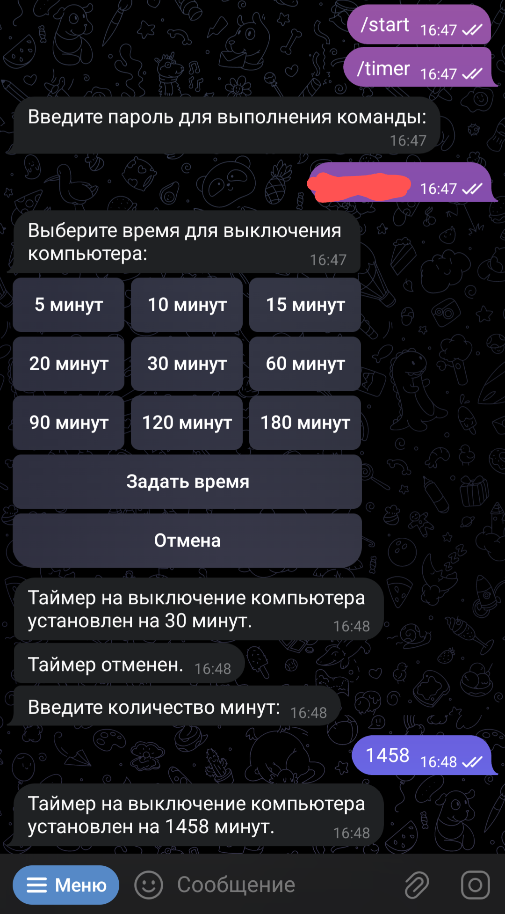
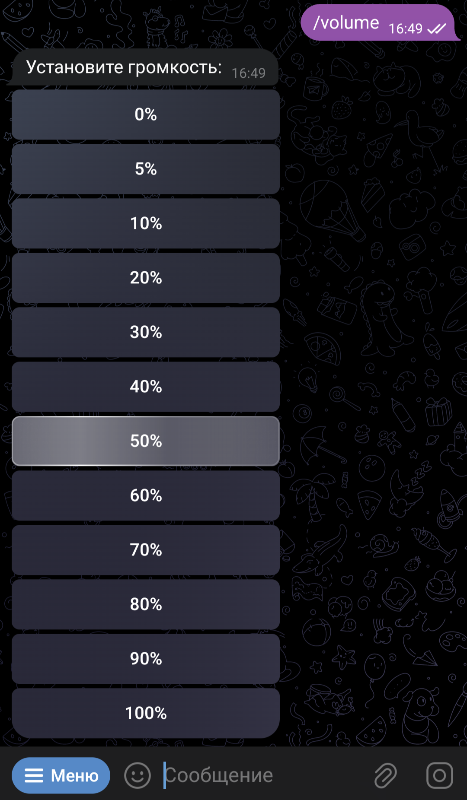
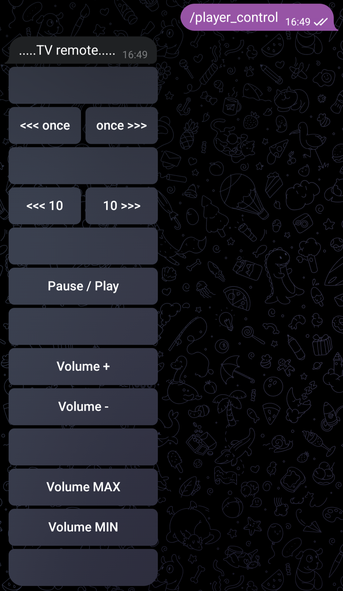

# PC_control_telegram_bot
Telegram bot with password defend for PC control
________________________________
Инструкция:
1) Создаём собственного бота через телеграм бота @BotFather
2) Устанавливаем в "Config.ini" свои данные (api_ip, api_hash, PASSWORD)
3) Убеждаемся что в директории с программой находится утилита NirCMD.exe (нужна для управления регулировкой громкости).
При необходимости нужно установить эту утилиту в систему.
4) Запускаем скрипт на ПК, которым требуется управлять и указываем в консоли токен своего бота
(pyrogram запросит токен при первом запуске чтобы создать файл сессии)
________________________________

Screenshots:

</img>
</img>

</img>
</img>

