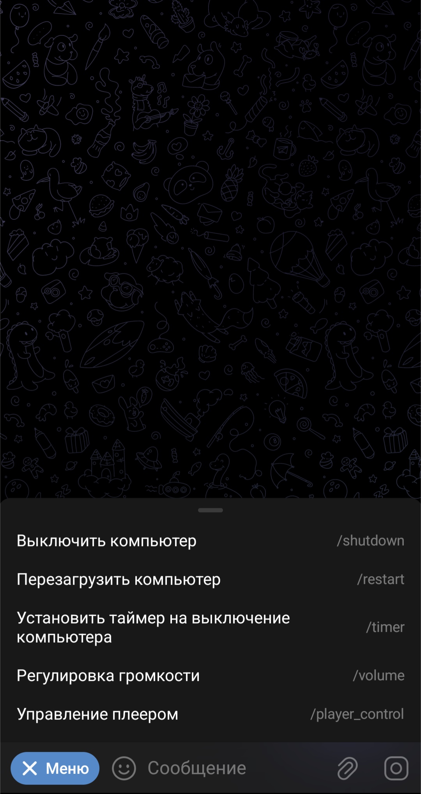

# PC_control_telegram_bot
________________________________
Инструкция:
1) Создаём собственного бота через телеграм бота @BotFather.
2) Устанавливаем\проверяем данные в "Config.ini" (api_token, PASSWORD, путь к AnyDesk).
3) Устанавливаем системную утилиту NirCMD.exe (требуется для управления уровнем громкости Windows).
4) Запускаем скрипт на ПК от имени администратора, которым требуется управлять.
________________________________

Screenshots:
 

</img>
</img>

</img>
</img>

